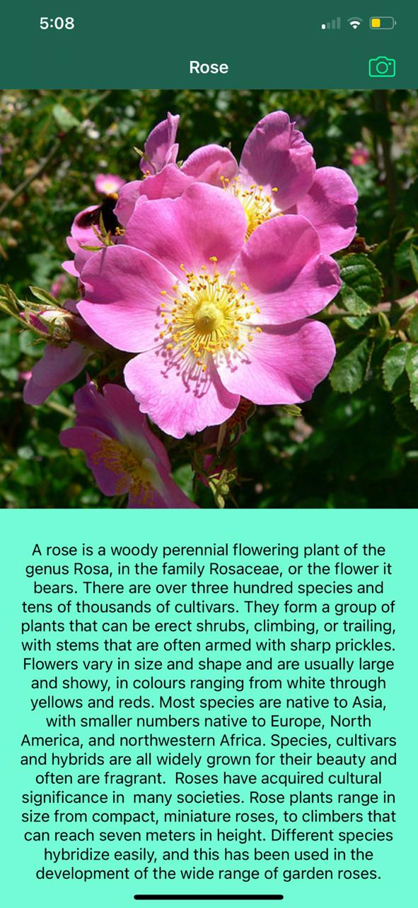

# Caution you need to download (FlowerClassifier.mlmodel), because I couldn't upload it with the project cause github refuses it cause it over 200MB, so u can send me a message and I'll send ya.

# Flower Identifier

## An app that can analyze the image of the Flower that you take via Camera then give you the name of it and read the description that the app get from WIKI for you, and need the internet to bring the description, but it can tell you the name of the flower without the internet.

* Used CoreML to identify the flower, and give you the description.
* Used the WIKI API to bring the information about the captured flower, and replace the taken pic with one from WIKI.
* Used AVFoundation to read the results.

## You can modify one line of code to make it take a pic from The Gallery.

 imagePicker.sourceType = .camera  with 
//imagePicker.sourceType = .photoLibrary

## Here's a screenshot when u got internet.

## Here's a screenshot when u got no internet.

